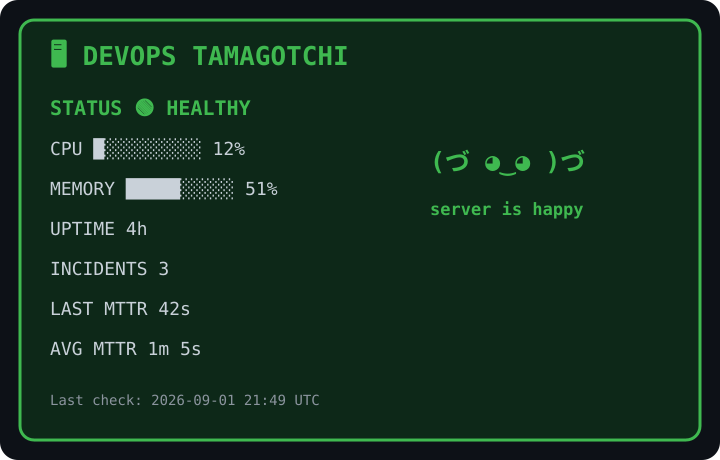

# 🐣 DevOps Tamagotchi

> A tiny virtual production server kept alive entirely by GitHub Actions.

<p align="center">
  
</p>

## 🚨 Incident Response

Production incidents are automatically tracked from detection through recovery.

👉 **[View the full incident history](./INCIDENTS.md)**

Every tracked incident records:

- cause
- start time
- resolution time
- MTTR
- current status
- an automatically generated postmortem

The incident lifecycle is managed entirely by GitHub Actions:

```text
😈 Chaos
    ↓
🔴 Incident
    ↓
📊 Tracking
    ↓
💚 Recovery
    ↓
⏱️ MTTR
    ↓
📝 Postmortem
```

## What is this?

DevOps Tamagotchi is a tiny simulated production environment living inside a GitHub repository.

Every hour, GitHub Actions:

- 🩺 performs a health check
- 📊 generates fake CPU and memory telemetry
- 🎲 decides whether production is healthy, degraded, or on fire
- 💾 persists its current state
- 🎨 regenerates the dashboard above
- 🤖 commits the updated state back to the repository

You can also manually poke production using the **😈 Poke Prod** workflow.

Available chaos controls:

- 💥 `incident` — cause a generic production incident
- 🔥 `cpu` — saturate CPU
- 🧠 `memory` — simulate a memory leak
- 💚 `heal` — resolve the active incident
- 🍪 `feed` — give the server a snack

No server.

Just GitHub Actions keeping a fake server emotionally stable.

## Architecture

```text
                    GitHub Actions
                          │
              ┌───────────┴───────────┐
              │                       │
              ▼                       ▼
      🐣 Health Check           😈 Poke Prod
              │                       │
              │                 ┌─────┴─────┐
              │                 │           │
              ▼                 ▼           ▼
        tamagotchi.py      poke_prod.py   chaos
              │                 │
              └────────┬────────┘
                       │
              ┌────────┴────────┐
              ▼                 ▼
          state.json      incidents.json
              │
              ▼
        dashboard.svg
              │
              ▼
           README
```


## Incident lifecycle & Possible States

**State Meaning:**
- 🟢 Healthy	prod is vibing
- 🟡 Degraded	prod feels suspicious
- 🔴 Incident	somebody wake up on-call

```
🟢 HEALTHY
     │
     │ 😈 poke prod
     ▼
🔴 INCIDENT
     │
     │ incident timer running
     │
     │ 💚 heal
     ▼
🟢 HEALTHY
     │
     ├── Last MTTR
     └── Average MTTR
```

## Built with

- GitHub Actions
- Python
- SVG
- cron
- persistent JSON state
- incident tracking
- MTTR calculation
- questionable production decisions
