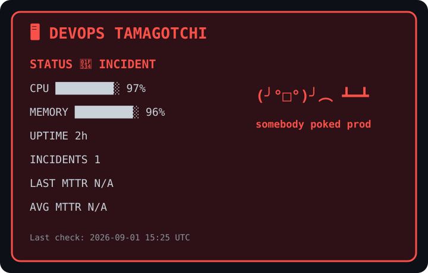

# 🐣 DevOps Tamagotchi

> A tiny virtual production server kept alive entirely by GitHub Actions.

<p align="center">
  
</p>

## What is this?

DevOps Tamagotchi is a tiny simulated production environment living inside a GitHub repository.

Every hour, GitHub Actions:

- 🩺 performs a health check
- 📊 generates fake CPU and memory telemetry
- 🎲 decides whether production is healthy, degraded, or on fire
- 💾 persists its current state
- 🎨 regenerates the dashboard above
- 🤖 commits the updated state back to the repository

No server.

No cloud account.

Just GitHub Actions keeping a fake server emotionally stable.

## Architecture

```text
        GitHub Actions
              │
              ▼
      scheduled health check
              │
              ▼
        tamagotchi.py
              │
       ┌──────┴──────┐
       ▼             ▼
   state.json   dashboard.svg
       │             │
       └──────┬──────┘
              ▼
        automated commit
              │
              ▼
          README 🐣
```

## Possible states

State	Meaning:
- 🟢 Healthy	prod is vibing
- 🟡 Degraded	prod feels suspicious
- 🔴 Incident	somebody wake up on-call


## Built with

- GitHub Actions
- Python
- SVG
- cron
- questionable production decisions
